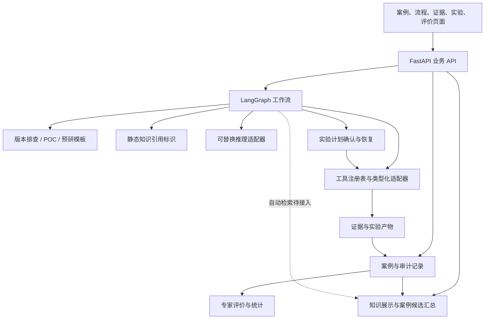

# 超融合存储性能专家 Agent：框架 Demo

## 建设范围

统一承载三类业务：版本内性能问题排查、外部 POC 调优、预研性能调优。第一阶段实现能运行、能留痕、能查看、能评价的底座，具体专家策略和环境工具后续逐步接入。

每个案例可以执行多轮分析，各轮独立保存场景输入、工作流与工具元数据、每一步执行记录、证据、根因假设、实验计划、实验结果、建议与专家评价。页面上的统计来自这些记录，而不是由模型给自己打分。

## 产品知识边界

- 三节点 HCI 集群向虚拟机提供分布式存储服务；性能测试入口是虚拟机内 fio。
- 协议包括 NFS、vhost、iSCSI。IOR 是业务层入口，IOR 之前属于协议层，之后共用业务和存储链路。
- 当前只覆盖 POC 聚合副本：数据放在本地主机和一个远端主机。非聚合场景暂不纳入。
- 现有 IO 文档实际包含高深度 4K 随机读和写的采样路径。配置 `iodepth=64 × numjobs=8` 表示目标总深度 512，不能代替实测在途深度。
- NFS 示例前端经过 QEMU/libnfs 与同机 Unix socket；读走示例中的本地数据路径，写包含本地 VSSHM 和远端 TCP 数据分支，AFR 汇合结果。仲裁成员参与控制操作。
- 文档里的 PID、TID、IP 和设备映射是该次采样实例。vhost/iSCSI 的协议内部流程待专家补充。
- 部门材料中的 Turbo、RDMA 不自动等同于某个协议，后续单独建模。

## 框架选择

采用 LangGraph 编排有状态工作流，FastAPI 提供业务 API，SQLite 保存案例和执行状态，React/TypeScript 提供操作页面。LangGraph 的持久化和中断恢复用于实验前暂停、确认后继续。

选择依据：

- [LangGraph overview](https://docs.langchain.com/oss/python/langgraph/overview)
- [Interrupts](https://docs.langchain.com/oss/python/langgraph/interrupts)
- [Persistence](https://docs.langchain.com/oss/python/langgraph/persistence)

SQLite 适合本地单服务 Demo。生产部署时，案例存储、checkpoint 存储和任务调度需要替换为适合多实例的实现。

## 分层与扩展

页面依赖稳定的案例、阶段和工具契约。新增策略或工具时扩展注册表和适配器，现有页面展示工作流阶段和工具元数据。三类业务分别定义目标和关注点，当前复用统一场景输入、同一个示例分析策略和单变量实验计划；专用输入、判断策略与实验方法后续按专家流程补充。新增业务类型还需扩展前端选择入口与标签。

知识页面展示架构事实、定位方法与专家确认的模拟案例候选。工作流当前记录静态知识引用 ID；尚未自动检索知识正文或将历史案例送入推理服务。

## 建议评价口径

建议的生成、实验效果与专家判定分别记录。实验改善并不能自动证明根因假设正确。

专家可以将建议标为已确认、已否定或待验证，并填写理由。确认率按 `已确认 / (已确认 + 已否定)` 计算；待验证不进入分母，页面展示样本量。这个指标描述已评价建议的确认情况，不直接代表生产环境诊断准确率。

建议统计按各轮运行中每条建议的最新判定计数；重复评审保留历史，但不增加建议数量。历史运行页面只读，API 可通过显式 `run_id` 追加历史复核，更新对应运行而不改变当前运行。

模拟数据不能混入真实业务成效。接入实测数据后，运营统计需要按来源、场景、版本和工作流版本分别查看。

## 当前 Demo 与后续实施

当前默认入口已收敛为版本内排查：固定硬件环境、同一 fio 模型，直接比较最近一次测试。批次导入与配对、线程 CPU/perf/NUMA/网卡差异、LangGraph 证据规则、候选验证步骤与历次专家评价已经实现。规则和 Linux 采集入口独立扩展，具体边界见 [扩展指南](扩展指南.md) 与 [采集说明](../collectors/README.md)。

框架执行、案例持久化、流程暂停恢复、页面交互和评价统计是真实实现。默认性能指标与采集证据明确标为模拟；版本排查可导入规范实测数据，候选由所选记录计算。Linux 采集未在用户集群运行。旧三类案例的实验结果仍为模拟，不能作为实测结论。

后续按业务优先级接入：

1. 专家补充三类业务的输入、判断规则、实验方法和结论标准。
2. 接入 fio 结果、采样文件、日志与配置采集器。
3. 接入性能环境、版本比较、测试调度和升级工具。
4. 接入选定的模型服务，用真实证据支撑候选根因，并保留人工判断。
5. 加入多用户身份、权限、长任务调度、产物存储、运行版本管理和生产指标。
