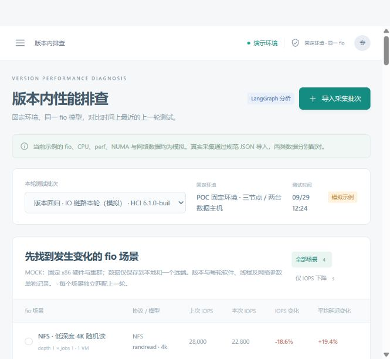
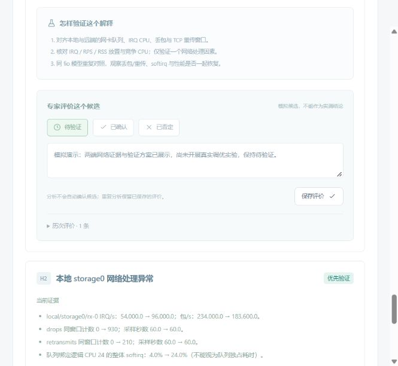

# 版本内性能排查落地验证

验证日期：2026-09-29。页面地址：<http://127.0.0.1:8000/#version>。

## 本轮落地

默认入口改为版本内排查，固定环境、同一完整 fio 模型，按时间寻找最近一次记录。批次和 fio 场景选择之后，页面直接展示结果、线程 CPU/perf/单位 IO 成本、CPU/NUMA、两端网卡 IRQ 与 softirq、变更背景、采集质量、候选验证与历次评价。

版本数据使用独立 SQLite；批次不可覆盖，模拟与实测分别配对。LangGraph 实际运行六个分析节点，规则函数独立注册并保存版本。CPU 成本候选要求每 IO 成本增加至少 15%，且线程池 CPU 消耗速率增加至少 10%；只有吞吐下降造成的归一化成本增加留在指标表中。所有候选初始为待验证。

## 自动验证

- `python -m pytest backend/tests collectors/tests -q`：39 项通过，其中后端 27 项、采集器 12 项。
- `pnpm build`：TypeScript 检查与 Vite 生产构建通过。
- `python -m collectors --help`：本地 CLI 可用；Windows 活体采集被明确拒绝，合并和解析可运行。
- 采集包 → 规范 Batch → 实际导入 API → 最近上轮配对 → LangGraph 分析已通过合成数据联调。
- 覆盖完整 fio 参数匹配、模拟/实测隔离、环境/协议隔离、补录历史的重新配对、评价持久化与重复分析、PMU 范围/计数覆盖、未知指标、加权 IPC、不同采样时长的 CPU/等待归一、线程生命周期和窗口一致性。

## 页面验收

通过浏览器实际操作完成：

1. 测试批次和 fio 场景切换；下降筛选；首次记录显示没有上轮。
2. 两个新的模拟批次通过 JSON 窗口导入，自动配为 build.28 → build.29。
3. 高深度随机写生成两个本地/远端网络候选；低深度随机读生成调度、IPC、NUMA、CPU 成本四个候选；稳定高深度读没有固定根因建议。
4. 专家评价后统计更新，刷新仍保留备注和历史；模拟验收备注明确未开展真实实验。
5. 非法 JSON 显示格式错误；缺少字段显示对应字段；规范示例明确 source=mock。
6. 检查 1440×960 与 390×844 布局，表格在自身容器横向滚动，窄屏导入窗口及操作按钮在视口内。完成后恢复默认窗口。
7. 浏览器控制台没有 error；后台服务健康，监听 127.0.0.1:8000。

当前演示共七个模拟批次。最终展示批次为 `VB-IO-PREVIEW-34d08a9f-0` / `VB-IO-PREVIEW-34d08a9f-1`，线程归属已按原始 IO 文档校准为 asan-stord/gfapi-opt、glusterfsd/glfsd-net 与 asan-stord/tierd-core；真实数据未导入。此前版本 1.0 规则生成的分析及模拟评价保留，新配对使用收敛后的 1.1 CPU 规则；不覆盖已评价分析。

## 保留与边界

旧案例 `HCI-619D9708` 的两次运行仍保留（已完成、已取消）。用户 IO 文档未改动，SHA256 为 `1AEE62FBD845967B09F4EA0C62AC0EFDAD36BF8C8BAE5CDB9A3C84ADED2EEB46`。

Linux 采集入口已实现 proc/sys、全窗口 perf stat、短窗口 perf record 与批次合并。本轮未连接真实集群、运行 fio 或改动设备设置。真实 Linux perf 权限、内核兼容性、采集扰动与窗口同步仍需环境验收；函数热点解析、产品软亲和、阻塞栈、竞争进程归因、队列包量及真实远端访存比例仍需适配器补充。未收集的值保持 null，详见 [采集说明](../collectors/README.md)。
