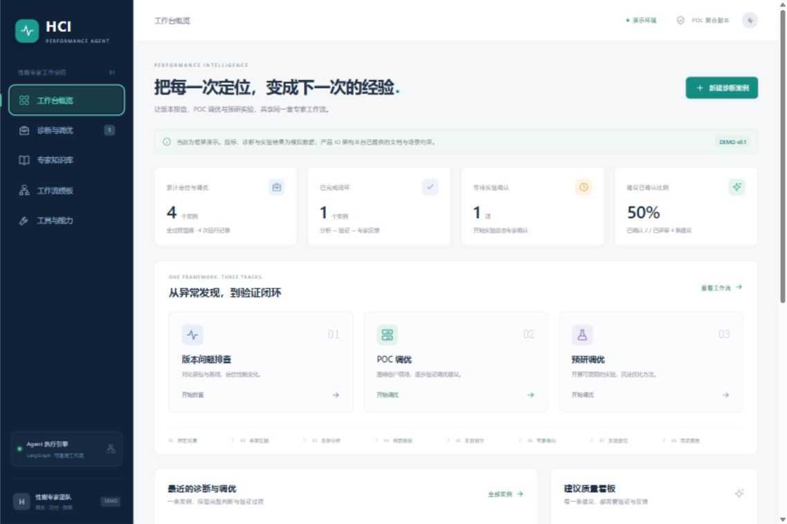

# Demo 验证记录

验证日期：2026-09-29。环境：Windows，本机单进程服务，默认确定性演示推理，无模型 API key，无真实集群连接。

## 构建与后端

- `pnpm run build`：TypeScript 类型检查与 Vite 生产构建通过。
- `.venv\Scripts\python.exe -m pytest backend/tests -q`：11 项测试通过。
- 后端测试覆盖工作流中断恢复、确认与拒绝实验、反馈约束、多轮归档、历史复核隔离、统计去重，以及自定义工具和分析策略的实际调用。
- 启动、停止脚本通过 PowerShell 语法检查。实际停止旧服务、启动新服务，并完成新版进程身份核验的停止与再次启动；最终服务继续运行。

## 页面实际操作

在浏览器创建案例 `HCI-619D9708`，使用版本排查模板和 NFS 4K 随机写模型（案例标题包含 POC，数据布局始终为本地加一个远端）。

1. 启动模拟分析，五个阶段完成，停在专家确认节点。
2. 检查单变量实验步骤，填写备注并确认，生成模拟实验结果与归档报告。
3. 将第一条建议判为已确认、第二条判为已否定，保存理由，展开历次评审记录。
4. 启动新一轮分析，独立生成证据与待确认计划；上一轮证据、实验和反馈保持可查，历史页面只读。
5. 拒绝第二轮实验，保留确认记录并归档；实验阶段显示已跳过，流程进度显示 8/8。
6. 重启服务后再次打开案例，当前运行与历史运行、建议评价均保留。
7. 打开历史 JSON 导出预览，解析得到正确的历史运行编号、5 份证据、16 条事件及两条评审历史。下载按钮已实现；本次内置浏览器未返回下载事件，未把下载落盘记为验证通过。
8. 浏览知识库、工作流模板和工具能力页，检查 NFS 架构来源、IOR 边界、两台数据主机和工具说明；案例过滤正常。

概览统计显示：4 个案例、4 次运行、8 条建议，已确认 2、已否定 2、待验证 4；确认比例为 2/4，即 50%。这些均是演示统计。

桌面 1440×960、手机 390×844 和常规窗口布局已检查。手机概览与创建表单没有横向溢出，菜单可以切换页面。临时视口设置已恢复。最终浏览器错误日志为空。

## 数据边界

流程编排、持久化、审计、确认恢复和专家反馈是真实实现。性能数值、分层采样、候选根因、实验收益为模拟内容；未运行真实 fio、修改集群或验证真实根因。

原始 `VM 到存储后端完整 IO 流.md` 保留，SHA256 核对未变：

`1AEE62FBD845967B09F4EA0C62AC0EFDAD36BF8C8BAE5CDB9A3C84ADED2EEB46`

页面截图：。
